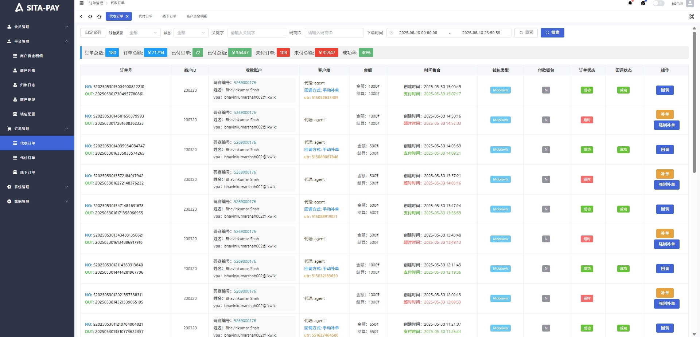
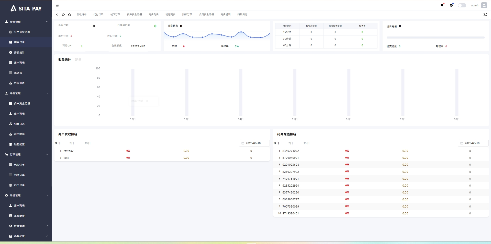

# indianPaySystem  
印度支付系统｜印度代收系统｜跑分系统出租／出售｜钱包接入｜系统部署｜Tail 技术支持团队

---

### 🌟 **Tail 技术服务团队（Tail IT Solutions）**

#### 📍 专注印度支付系统 · 六年实战经验积累

Tail 团队深耕印度本地支付场景，专注于提供**稳定高效、可扩展、安全合规**的支付解决方案，协助客户建立面向平台与商户的多功能收付款系统，应对市场快速变化带来的挑战。

---

### 💼 **项目落地丰富 · 深受客户信赖**

我们打造的系统支持多钱包接入、并发处理能力强，已为上百家客户交付**可运营、可扩展、可维护**的支付平台。Tail 团队在实施过程中注重定制化服务，广受客户认可。

---

### 🚀 **产品进化持续优化 · 赋能业务增长**

通过不断技术迭代，我们为客户提供具备**自动对账、风险控制、灵活配置**能力的完整系统架构，助力实现交易效率提升与运营成本降低。

---

### 🛠️ **核心功能模块**

#### 💳 **钱包收付系统（跑分系统）**

- 用户无需绑定银行卡，通过印度本地用户注册的钱包 APP 提供 UPI 支付通道  
- 系统自动处理收付款任务，佣金实时到账  
- 支持平台、商户接入使用，减少账户问题，提高交易效率

**支持收款钱包：** Mobikwik、Airtel、PhonePe、Freecharge  
**支持付款钱包：** Mobikwik、Freecharge  

> 创新支付架构，助力客户提升系统安全性与业务弹性

  

---

### ✅ **配套工具支持**

- Telegram 机器人支持自助查单、补单  
- 专用财务记账机器人（流水记录、自动汇总）

---

### 📬 **服务说明**

提供系统租赁、定制开发、长期技术支持  
如需合作或进一步了解服务细节，请联系：

👉 [Tail Pay 客服](https://t.me/tailpay) （Telegram：@tailpay）

---
